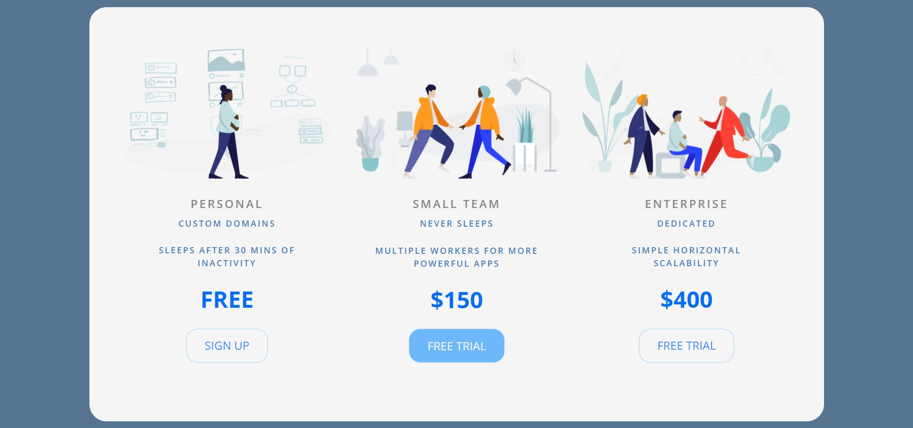
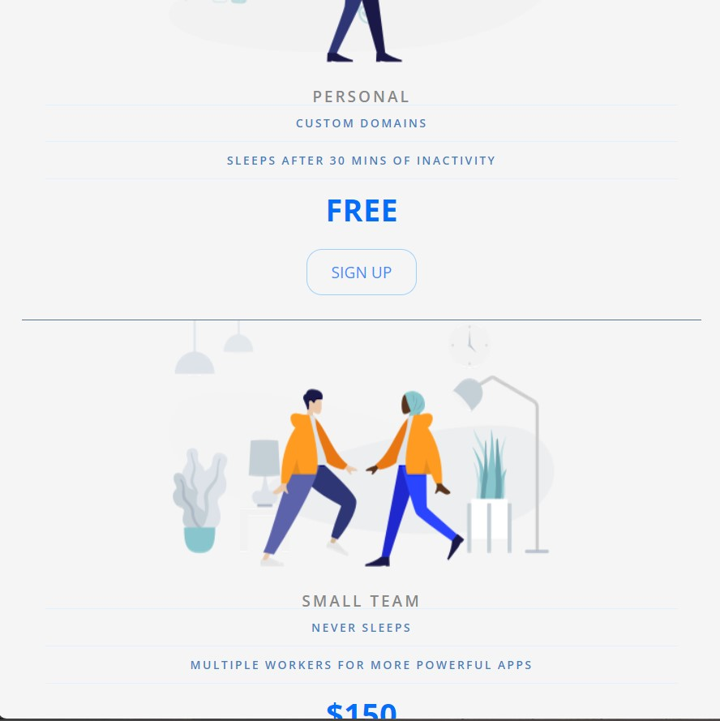

# Price Tiers

This is a simple HTML page that displays three different price tiers for a product or service. Each price tier comes with its own set of features and pricing information.

## Getting Started

To view the page, simply open the HTML file in a web browser of your choice. The file contains the necessary HTML structure and CSS styles to render the pricing table properly.

## Usage

The pricing table consists of three pricing plans: Personal, Small team, and Enterprise. Each plan is represented by a separate 
 element with a corresponding class name.

### Personal

- Custom domains
- Sleeps after 30 mins of inactivity
- Price: Free

### Small team

- Never sleeps
- Multiple workers for more powerful apps
- Price: $150

### Enterprise

- Dedicated
- Simple horizontal scalability
- Price: $400

## Styling

The page uses the following CSS styles:

- The font family "Open Sans" is used for the text.
- The background color of the body is set to #577590.
- The pricing table is displayed as a panel with a white background color.
- The pricing features are displayed in a list format.
- The middle pricing button has a different background color and white text.

## Credits

The CSS reset used in this page is from Eric Meyer's "Reset CSS" version 2.0. The reset is applied to ensure consistent styling across different browsers.

The page also uses the Google Fonts API to load the "Open Sans" font.

;

;

;
